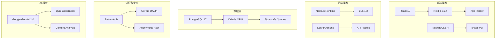
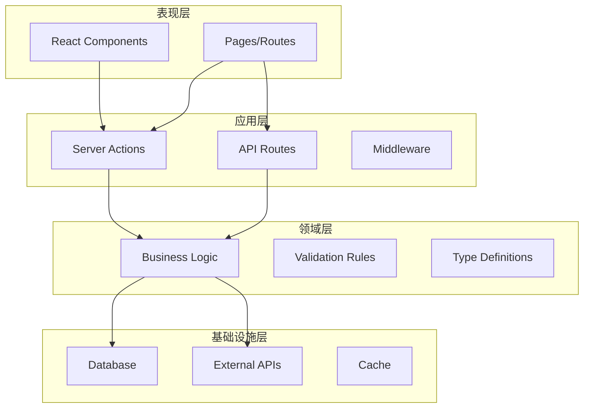
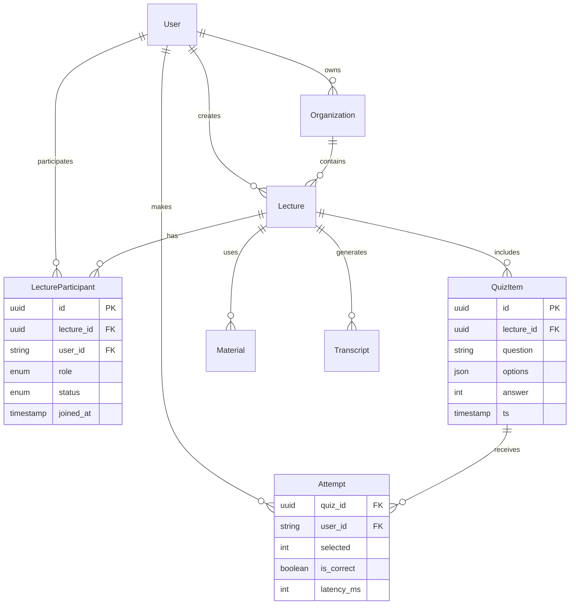
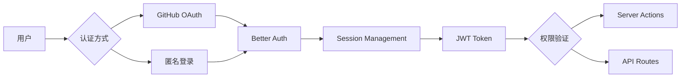
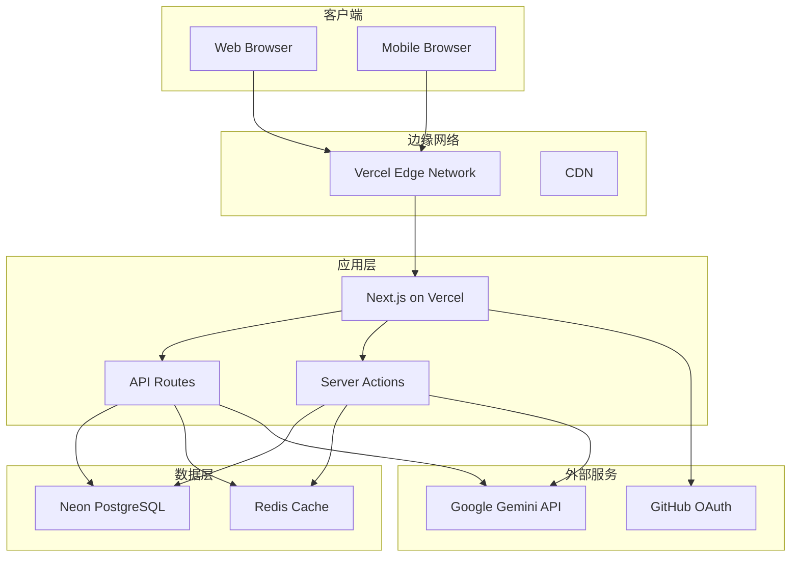

# QuizGen 项目架构文档

## 目录

1. [系统概述](#系统概述)
2. [技术架构](#技术架构)
3. [应用架构](#应用架构)
4. [数据架构](#数据架构)
5. [安全架构](#安全架构)
6. [部署架构](#部署架构)
7. [扩展性设计](#扩展性设计)

## 系统概述

QuizGen 是一个演讲即时智能评测系统，旨在帮助演讲者实时了解听众的理解程度，提高演讲互动性和效果。系统通过 AI 技术自动生成测验题目，实现演讲过程中的即时反馈。

### 核心价值

- **实时反馈**：演讲者可即时了解听众理解程度
- **智能出题**：基于演讲内容自动生成高质量测验题
- **低门槛参与**：听众通过简单扫码即可参与互动
- **数据驱动**：通过统计分析优化演讲效果

### 用户角色

1. **演讲者 (Speaker)**：创建演讲、上传材料、查看反馈
2. **听众 (Audience)**：加入演讲、答题互动、查看成绩
3. **组织者 (Organizer)**：管理系列演讲、查看整体数据

## 技术架构

### 技术栈选型



### 技术选型理由

| 技术 | 选择理由 |
|------|----------|
| **Next.js 15** | - App Router 提供更好的性能和 DX<br>- Server Actions 简化数据交互<br>- 内置优化和 SEO 支持 |
| **Bun** | - 极快的包安装和脚本执行速度<br>- 原生 TypeScript 支持<br>- 统一的工具链 |
| **Drizzle ORM** | - 完全类型安全的数据库操作<br>- 轻量级，性能优异<br>- 优秀的开发体验 |
| **Better Auth** | - 现代化的认证解决方案<br>- 支持多种认证方式<br>- 与 Next.js 深度集成 |
| **TailwindCSS 4** | - JIT 编译，极小的 CSS 体积<br>- 组件化开发友好<br>- 完善的设计系统 |
| **Google Gemini** | - 强大的多模态理解能力<br>- 高质量的内容生成<br>- 成本效益高 |

## 应用架构

### Monorepo 结构

项目采用 Turborepo 管理的 Monorepo 架构，实现代码共享和模块化开发：

```
quizgen/
├── apps/
│   └── web/                    # Next.js 主应用
│       ├── src/
│       │   ├── app/           # 页面和路由
│       │   │   ├── (dashboard)/  # 主功能模块
│       │   │   │   ├── lectures/    # 演讲管理
│       │   │   │   ├── organizations/ # 组织管理
│       │   │   │   └── participation/ # 参与互动
│       │   │   ├── actions/     # Server Actions
│       │   │   └── api/         # API 路由
│       │   ├── components/    # React 组件
│       │   ├── hooks/         # 自定义 Hooks
│       │   ├── lib/           # 工具函数
│       │   └── types.ts       # 类型定义
│       └── public/            # 静态资源
├── packages/
│   ├── ai/                    # AI 功能封装
│   ├── auth/                  # 认证模块
│   ├── db/                    # 数据库层
│   └── ui/                    # UI 组件库
└── docs/                      # 项目文档
```

### 分层架构



### 核心模块设计

#### 1. 演讲管理模块

- **功能**：创建演讲、管理状态、生成邀请码
- **Server Actions**：
  - `createLecture`: 创建新演讲
  - `updateLectureStatus`: 更新演讲状态
  - `getLectures`: 获取演讲列表
  - `deleteLecture`: 删除演讲

#### 2. 测验生成模块

- **功能**：基于材料生成测验题目
- **流程**：
  1. 接收演讲材料（文本/音频/视频）
  2. 提取关键内容
  3. 调用 Gemini API 生成题目
  4. 验证题目质量
  5. 存储到数据库

#### 3. 实时互动模块

- **功能**：推送题目、接收答案、统计结果
- **技术**：Server-Sent Events (SSE) 实现实时推送
- **优化**：批量处理答案，减少数据库压力

#### 4. 数据分析模块

- **功能**：生成报表、可视化展示
- **维度**：
  - 题目正确率
  - 参与度分析
  - 时间分布
  - 难度评估

## 数据架构

### 数据模型



### 数据流设计

1. **写入优化**
   - 使用批量插入减少数据库连接
   - 答题数据先缓存后批量写入
   - 非关键数据异步处理

2. **查询优化**
   - 合理使用索引提升查询性能
   - 统计数据定期预计算
   - 使用数据库视图简化复杂查询

3. **数据一致性**
   - 使用事务保证关键操作的原子性
   - 外键约束维护引用完整性
   - 软删除保留历史数据

## 安全架构

### 认证与授权



### 安全措施

1. **身份认证**
   - Better Auth 提供安全的会话管理
   - 支持 OAuth 和匿名登录
   - JWT 令牌自动刷新

2. **数据验证**
   - Zod schema 验证所有输入
   - SQL 注入防护（参数化查询）
   - XSS 防护（React 自动转义）

3. **访问控制**
   - Server Actions 级别的权限检查
   - 基于角色的访问控制 (RBAC)
   - 资源所有权验证

4. **数据保护**
   - HTTPS 加密传输
   - 敏感数据加密存储
   - 定期安全审计

## 部署架构

### 生产环境架构



### 部署策略

1. **应用部署**
   - Vercel 自动部署（Git push 触发）
   - Preview 环境用于测试
   - 生产环境自动扩展

2. **数据库部署**
   - Neon Serverless PostgreSQL
   - 自动备份和恢复
   - 连接池优化

3. **监控与日志**
   - Vercel Analytics 监控性能
   - 错误追踪和告警
   - 用户行为分析

## 扩展性设计

### 水平扩展

1. **应用层扩展**
   - Vercel 自动扩展实例
   - 无状态设计支持多实例
   - 边缘函数分散负载

2. **数据库扩展**
   - 读写分离架构预留
   - 分库分表方案设计
   - 缓存层减少数据库压力

### 功能扩展

1. **插件化设计**
   - AI 提供商可替换（接口抽象）
   - 认证方式可扩展
   - 存储后端可切换

2. **微服务预留**
   - 测验生成服务可独立部署
   - 实时通信可升级为 WebSocket
   - 数据分析可独立为服务

### 性能优化

1. **前端优化**
   - 路由预加载
   - 图片懒加载
   - 组件按需加载

2. **后端优化**
   - 数据库查询优化
   - 缓存策略优化
   - 并发控制

3. **AI 优化**
   - 提示词缓存
   - 批量处理请求
   - 降级方案设计

## 总结

QuizGen 采用现代化的技术架构，通过 Next.js 15 的 Server Actions 简化了前后端交互，使用 Drizzle ORM 保证了类型安全，通过 Better Auth 提供了灵活的认证方案。整体架构设计注重可扩展性、安全性和用户体验，为未来的功能迭代和性能优化奠定了坚实基础。

关键架构决策：
- **Monorepo**: 提高代码复用，统一依赖管理
- **Server Actions**: 简化 API 开发，增强类型安全
- **Serverless**: 自动扩展，按需付费
- **类型安全**: 端到端的 TypeScript 支持
- **模块化**: 清晰的职责划分，便于维护