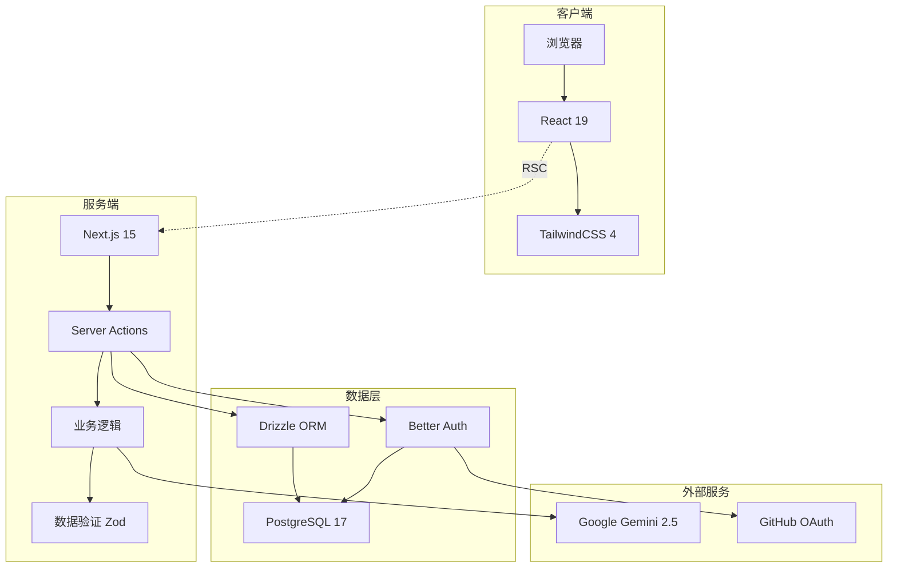
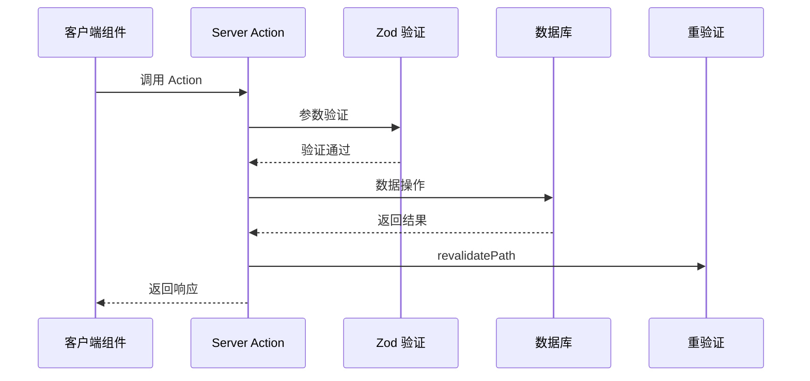
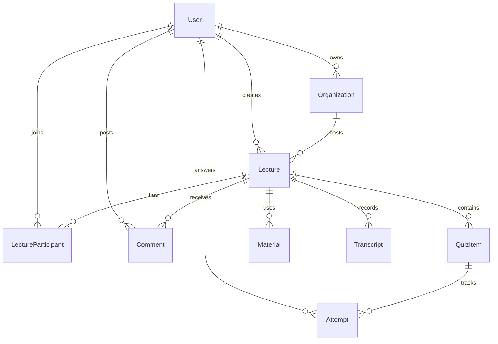
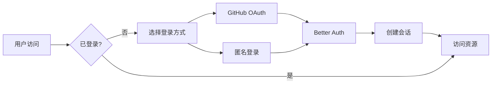
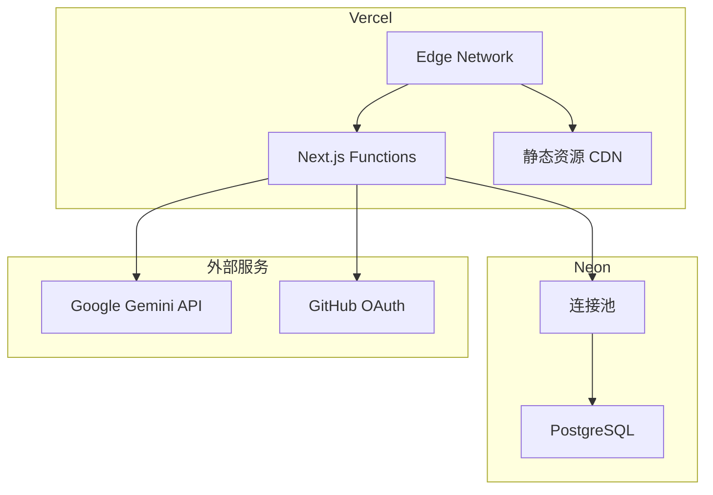

# QuizGen 项目架构

## 目录

- [系统概述](#系统概述)
- [技术架构](#技术架构)
- [应用架构](#应用架构)
- [数据架构](#数据架构)
- [安全架构](#安全架构)
- [部署架构](#部署架构)
- [性能优化](#性能优化)

## 系统概述

QuizGen 是一个演讲即时智能评测系统，通过 AI 自动生成测验题目，帮助演讲者实时了解听众理解程度。

### 核心价值

- **实时反馈** - 即时了解听众理解程度
- **智能出题** - AI 自动生成高质量测验
- **低门槛参与** - 扫码即可匿名参与
- **数据驱动** - 统计分析优化演讲效果

### 用户角色

- **演讲者** - 创建演讲、生成测验、查看数据
- **听众** - 参与答题、即时反馈、查看成绩
- **组织者** - 管理演讲系列、查看整体数据

## 技术架构

### 技术栈

| 层级       | 技术选型      | 版本    | 选型理由                             |
| ---------- | ------------- | ------- | ------------------------------------ |
| **运行时** | Bun           | 1.2.19  | 极速包管理、原生 TypeScript 支持     |
| **框架**   | Next.js       | 15.4.4  | Server Actions、App Router、性能优化 |
| **UI**     | React         | 19.1.0  | 最新特性、并发渲染、自动批处理       |
| **样式**   | TailwindCSS   | 4.1.11  | CSS 引擎重写、极速编译、组件友好     |
| **组件**   | shadcn/ui     | -       | 可定制、无依赖、类型安全             |
| **数据库** | PostgreSQL    | 17      | 成熟稳定、JSON 支持、性能优异        |
| **ORM**    | Drizzle       | 0.44    | 类型安全、轻量级、SQL-like API       |
| **认证**   | Better Auth   | 1.3.2   | 现代化、灵活配置、Next.js 集成       |
| **AI**     | Google Gemini | 2.5 Pro | 多模态理解、高质量生成、成本效益     |

### 架构图



## 应用架构

### Monorepo 结构

```
quizgen/
├── apps/
│   └── web/                    # Next.js 应用
│       ├── src/
│       │   ├── app/           # App Router
│       │   │   ├── (dashboard)/   # 业务模块
│       │   │   │   ├── lectures/     # 演讲管理
│       │   │   │   ├── organizations/ # 组织管理
│       │   │   │   └── participation/ # 参与互动
│       │   │   ├── actions/       # Server Actions
│       │   │   └── api/          # API 路由（特殊用途）
│       │   ├── components/       # React 组件
│       │   ├── hooks/           # 自定义 Hooks
│       │   ├── lib/            # 工具函数
│       │   └── types.ts        # 统一类型定义
│       └── public/             # 静态资源
│
├── packages/                   # 共享包
│   ├── ai/                    # AI 功能封装
│   ├── auth/                  # Better Auth 配置
│   ├── db/                    # Drizzle ORM + Schema
│   ├── ui/                    # shadcn/ui 组件
│   └── tsconfig/              # TypeScript 配置
│
└── docs/                      # 项目文档
```

### 核心模块

#### 1. Server Actions 体系

```typescript
// 统一的 Server Action 模式
'use server';

export async function actionName(input: InputType): Promise<ActionResult<OutputType>> {
  // 1. 身份验证
  const { user } = await requireAuth();
  
  // 2. 参数验证
  const validated = schema.parse(input);
  
  // 3. 业务逻辑
  const result = await db.transaction(async (tx) => {
    // 事务操作
  });
  
  // 4. 路径重验证
  revalidatePath('/relevant-path');
  
  // 5. 返回结果
  return { success: true, data: result };
}
```

#### 2. 类型系统

- 所有共享类型定义在 `apps/web/src/types.ts`
- 使用 `DateToString<T>` 处理 Server Actions 日期序列化
- 端到端类型安全，禁止使用 `any`

#### 3. 数据流



## 数据架构

### 核心实体



### 关键表设计

#### lectures 表
- 状态管理：not_started → in_progress → paused/ended
- 邀请码生成：6位唯一码
- 软删除支持

#### quiz_items 表
- AI 生成的题目存储
- 推送时间戳记录
- 正确率统计支持

#### attempts 表
- 复合主键：(quiz_id, user_id)
- 响应时间记录
- 正确性追踪

## 安全架构

### 认证流程



### 安全措施

1. **身份验证**
   - Better Auth 会话管理
   - JWT 自动刷新
   - 安全 Cookie 设置

2. **数据验证**
   - Zod schema 强制验证
   - SQL 注入防护（参数化查询）
   - XSS 防护（React 自动转义）

3. **访问控制**
   - Server Actions 权限检查
   - 资源所有权验证
   - 角色权限控制

## 部署架构

### 生产环境



### 环境配置

- **开发环境** - 本地 PostgreSQL + Docker
- **预览环境** - Vercel Preview + Neon Branch
- **生产环境** - Vercel Production + Neon Main

## 性能优化

### 前端优化

1. **渲染优化**
   - React Server Components 减少客户端 JS
   - Suspense 边界优化加载体验
   - 动态导入按需加载组件

2. **资源优化**
   - 图片自动优化（next/image）
   - 字体子集化
   - 静态资源 CDN 分发

### 后端优化

1. **数据库优化**
   - 合理索引设计
   - 查询优化（避免 N+1）
   - 连接池管理

2. **缓存策略**
   - Server Actions 结果缓存
   - AI 提示词缓存
   - 静态页面 ISR

3. **并发控制**
   - 数据库事务隔离
   - 乐观锁实现
   - 请求限流

### 监控指标

- **性能指标** - Core Web Vitals
- **错误监控** - Sentry 集成
- **用户行为** - Vercel Analytics
- **数据库性能** - Neon 监控面板

---

> 架构设计注重简洁性、可维护性和扩展性，通过 Server Actions 简化开发流程，确保类型安全和最佳性能。