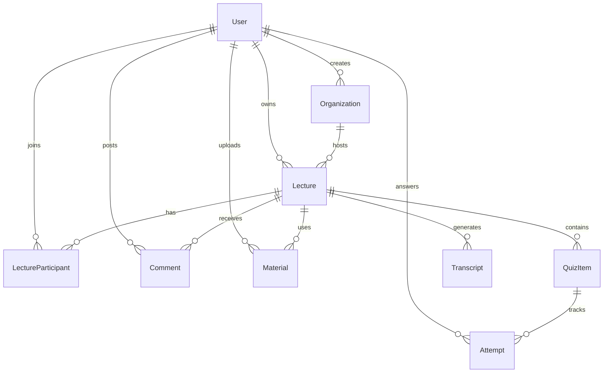

# QuizGen 数据库设计

## 目录

- [概述](#概述)
- [技术选型](#技术选型)
- [数据模型](#数据模型)
- [表结构详解](#表结构详解)
- [索引策略](#索引策略)
- [查询优化](#查询优化)
- [迁移管理](#迁移管理)
- [最佳实践](#最佳实践)

## 概述

QuizGen 使用 PostgreSQL 17 作为主数据库，通过 Drizzle ORM 提供类型安全的数据访问层。

### 设计原则

- **类型安全** - 端到端 TypeScript 类型推导
- **性能优先** - 合理索引和查询优化
- **数据完整性** - 外键约束和数据验证
- **易于扩展** - 清晰的表结构和关系

## 技术选型

### PostgreSQL 17
- 原生 JSON 支持（存储测验选项）
- 强大的事务和并发控制
- 丰富的数据类型（UUID、ENUM）
- 成熟的生态系统

### Drizzle ORM 0.44
- 完全类型安全，无运行时开销
- SQL-like API，学习成本低
- 内置迁移管理
- 优秀的 TypeScript 集成

### Neon Serverless
- Serverless PostgreSQL，自动扩展
- 分支数据库用于开发/预览
- 自动备份和时间点恢复
- 低延迟连接池

## 数据模型

### 核心实体关系



### 表概览

| 表名                 | 说明               | 主键               |
| -------------------- | ------------------ | ------------------ |
| users                | Better Auth 用户表 | id (text)          |
| organizations        | 组织信息           | id (uuid)          |
| lectures             | 演讲会话           | id (uuid)          |
| quiz_items           | 测验题目           | id (uuid)          |
| attempts             | 答题记录           | (quiz_id, user_id) |
| lecture_participants | 参与者记录         | id (uuid)          |
| materials            | 演讲材料           | id (uuid)          |
| transcripts          | 语音转录           | id (uuid)          |
| comments             | 演讲评论           | id (uuid)          |

## 表结构详解

### users 表
由 Better Auth 管理，存储用户认证信息。

### organizations 表
```typescript
{
  id: uuid,              // 主键
  name: text,           // 组织名称
  description: text,    // 组织描述
  access_code: text,    // 访问密码
  owner_id: text,       // 创建者ID -> users.id
  created_at: timestamp,
  updated_at: timestamp
}
```

### lectures 表
```typescript
{
  id: uuid,              // 主键
  title: text,          // 演讲标题
  description: text,    // 演讲描述
  owner_id: text,       // 创建者ID -> users.id
  org_id: uuid,         // 组织ID -> organizations.id
  join_code: text,      // 6位加入码（唯一）
  status: enum,         // not_started|in_progress|paused|ended
  starts_at: timestamp, // 开始时间
  ends_at: timestamp,   // 结束时间
  created_at: timestamp,
  updated_at: timestamp
}
```

### quiz_items 表
```typescript
{
  id: uuid,              // 主键
  lecture_id: uuid,     // 演讲ID -> lectures.id
  question: text,       // 题目内容
  options: json,        // string[] 四个选项
  answer: integer,      // 正确答案索引 (0-3)
  explanation: text,    // 答案解释
  ts: timestamp,        // 生成时间戳
  created_at: timestamp,
  pushed_at: timestamp  // 推送时间
}
```

### attempts 表
```typescript
{
  quiz_id: uuid,         // 题目ID -> quiz_items.id
  user_id: text,        // 用户ID -> users.id
  selected: integer,    // 用户选择 (0-3)
  is_correct: boolean,  // 是否正确
  latency_ms: integer,  // 答题耗时(毫秒)
  created_at: timestamp
}
// 复合主键: (quiz_id, user_id)
```

### lecture_participants 表
```typescript
{
  id: uuid,              // 主键
  lecture_id: uuid,     // 演讲ID -> lectures.id
  user_id: text,        // 用户ID -> users.id
  role: enum,           // speaker|audience|assistant
  status: enum,         // joined|active|left|kicked
  joined_at: timestamp, // 加入时间
  left_at: timestamp,   // 离开时间
  created_at: timestamp,
  updated_at: timestamp
}
```

### materials 表
```typescript
{
  id: uuid,              // 主键
  lecture_id: uuid,     // 演讲ID -> lectures.id
  file_name: text,      // 文件名
  file_type: text,      // MIME类型
  text_content: text,   // 提取的文本内容
  status: varchar(20),  // processing|completed|timeout
  error_message: text,  // 错误信息
  created_by: text,     // 上传者ID -> users.id
  created_at: timestamp,
  updated_at: timestamp
}
```

### transcripts 表
```typescript
{
  id: uuid,              // 主键
  lecture_id: uuid,     // 演讲ID -> lectures.id
  content: text,        // 转录内容
  start_time: timestamp,// 开始时间
  end_time: timestamp,  // 结束时间
  language: text,       // 语言代码 (默认: zh-CN)
  metadata: json,       // 元数据
  created_at: timestamp
}
```

### comments 表
```typescript
{
  id: uuid,              // 主键
  lecture_id: uuid,     // 演讲ID -> lectures.id
  user_id: text,        // 用户ID -> users.id
  content: text,        // 评论内容
  is_anonymous: boolean,// 是否匿名
  visibility: enum,     // public|speaker_only
  created_at: timestamp,
  updated_at: timestamp
}
```

## 索引策略

### 主键索引
所有表使用 UUID/复合主键，自动创建索引。

### 外键索引
```sql
-- organizations
CREATE INDEX idx_organizations_owner_id ON organizations(owner_id);

-- lectures
CREATE INDEX lectures_owner_id_idx ON lectures(owner_id);
CREATE INDEX lectures_org_id_idx ON lectures(org_id);
CREATE INDEX lectures_join_code_idx ON lectures(join_code);

-- quiz_items
CREATE INDEX quiz_items_lecture_id_idx ON quiz_items(lecture_id);
CREATE INDEX quiz_items_timestamp_idx ON quiz_items(ts);

-- attempts
CREATE INDEX idx_attempts_user_id ON attempts(user_id);
CREATE INDEX idx_attempts_quiz_id ON attempts(quiz_id);

-- comments
CREATE INDEX comments_lecture_id_idx ON comments(lecture_id);
CREATE INDEX comments_user_id_idx ON comments(user_id);
CREATE INDEX comments_created_at_idx ON comments(created_at);
```

### 业务查询索引
```sql
-- 活跃参与者查询
CREATE UNIQUE INDEX idx_participants_lecture_user 
  ON lecture_participants(lecture_id, user_id) 
  WHERE status IN ('joined', 'active');

-- 状态筛选
CREATE INDEX idx_lectures_status ON lectures(status);
CREATE INDEX idx_materials_status ON materials(status);
```

## 查询优化

### 常用查询示例

#### 获取演讲统计
```sql
SELECT 
  l.*,
  COUNT(DISTINCT p.user_id) as participant_count,
  COUNT(DISTINCT q.id) as quiz_count,
  COUNT(DISTINCT m.id) as material_count
FROM lectures l
LEFT JOIN lecture_participants p ON l.id = p.lecture_id
LEFT JOIN quiz_items q ON l.id = q.lecture_id
LEFT JOIN materials m ON l.id = m.lecture_id
WHERE l.id = $1
GROUP BY l.id;
```

#### 题目正确率统计
```sql
WITH quiz_stats AS (
  SELECT 
    q.id,
    COUNT(a.quiz_id) as total_attempts,
    COUNT(CASE WHEN a.is_correct THEN 1 END) as correct_attempts
  FROM quiz_items q
  LEFT JOIN attempts a ON q.id = a.quiz_id
  WHERE q.lecture_id = $1
  GROUP BY q.id
)
SELECT 
  q.*,
  COALESCE(s.total_attempts, 0) as attempt_count,
  COALESCE(s.correct_attempts, 0) as correct_count,
  CASE 
    WHEN s.total_attempts > 0 
    THEN s.correct_attempts::float / s.total_attempts 
    ELSE 0 
  END as correct_rate
FROM quiz_items q
LEFT JOIN quiz_stats s ON q.id = s.id
WHERE q.lecture_id = $1
ORDER BY q.ts DESC;
```

#### 用户参与历史
```sql
SELECT 
  l.*,
  p.role,
  p.joined_at,
  COUNT(DISTINCT a.quiz_id) as answered_count,
  COUNT(DISTINCT q.id) as total_quiz_count
FROM lecture_participants p
JOIN lectures l ON p.lecture_id = l.id
LEFT JOIN quiz_items q ON l.id = q.lecture_id AND q.pushed_at IS NOT NULL
LEFT JOIN attempts a ON q.id = a.quiz_id AND a.user_id = p.user_id
WHERE p.user_id = $1 AND p.status IN ('joined', 'active', 'left')
GROUP BY l.id, p.role, p.joined_at
ORDER BY p.joined_at DESC;
```

### 性能优化技巧

1. **使用事务批量操作**
```typescript
await db.transaction(async (tx) => {
  await tx.insert(quizItems).values(items);
  await tx.update(lectures).set({ updated_at: new Date() });
});
```

2. **避免 N+1 查询**
```typescript
// 使用 Drizzle 的关系查询
const lecturesWithQuizzes = await db.query.lectures.findMany({
  with: {
    quizItems: true,
    participants: true
  }
});
```

3. **连接池配置**
```typescript
const pool = new Pool({
  connectionString: process.env.DATABASE_URL,
  max: 20,
  idleTimeoutMillis: 30000,
  connectionTimeoutMillis: 2000,
});
```

## 迁移管理

### Drizzle Kit 命令

```bash
# 生成迁移文件
bun db:generate

# 推送到数据库
bun db:push

# 执行迁移
bun db:migrate

# 打开管理界面
bun db:studio
```

### 迁移最佳实践

1. **向后兼容** - 新迁移不破坏现有功能
2. **原子操作** - 每个迁移独立完整
3. **测试验证** - 在开发环境充分测试
4. **备份先行** - 生产迁移前备份数据

## 最佳实践

### 命名规范
- 表名：复数、小写下划线
- 列名：小写下划线
- 索引：`表名_列名_idx`
- 枚举：`表名_字段_enum`

### 数据类型选择
- ID：UUID（分布式友好）
- 时间：timestamp（时区敏感）
- 枚举：pgEnum（类型安全）
- JSON：结构化灵活数据

### 安全考虑
- 参数化查询防止注入
- 外键约束保证完整性
- 敏感数据加密存储
- 定期备份和审计

### 监控维护
```sql
-- 查看慢查询
SELECT query, mean_exec_time, calls
FROM pg_stat_statements
WHERE mean_exec_time > 100
ORDER BY mean_exec_time DESC;

-- 表大小统计
SELECT 
  tablename,
  pg_size_pretty(pg_total_relation_size(tablename::regclass)) AS size
FROM pg_tables
WHERE schemaname = 'public'
ORDER BY pg_total_relation_size(tablename::regclass) DESC;

-- 定期维护
VACUUM ANALYZE;
```

---

> 数据库设计充分考虑了类型安全、查询性能和数据完整性，为系统的稳定运行提供坚实基础。