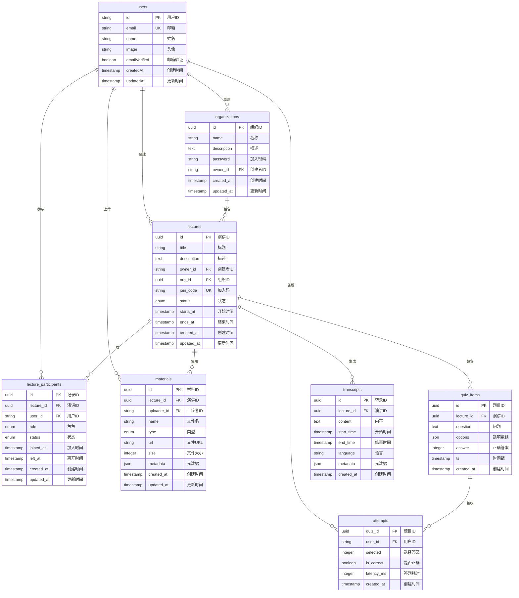

# QuizGen 数据库设计文档

## 目录

1. [概述](#概述)
2. [技术选型](#技术选型)
3. [数据模型设计](#数据模型设计)
4. [实体关系图](#实体关系图)
5. [表结构详解](#表结构详解)
6. [索引策略](#索引策略)
7. [数据完整性](#数据完整性)
8. [查询优化](#查询优化)
9. [迁移管理](#迁移管理)
10. [最佳实践](#最佳实践)

## 概述

QuizGen 使用 PostgreSQL 作为主数据库，通过 Drizzle ORM 进行数据访问。数据库设计遵循以下原则：

- **规范化设计**：避免数据冗余，保证数据一致性
- **性能优先**：合理使用索引，优化查询性能
- **扩展性**：预留扩展字段，支持未来功能
- **安全性**：使用外键约束，保证引用完整性

## 技术选型

### PostgreSQL

选择 PostgreSQL 的原因：
- 强大的 JSON 支持（用于存储测验选项）
- 完善的事务支持
- 优秀的并发性能
- 丰富的数据类型

### Drizzle ORM

选择 Drizzle 的原因：
- 完全的类型安全
- 轻量级，性能优异
- 支持原生 SQL 查询
- 迁移管理简单

### Neon Serverless

选择 Neon 的原因：
- Serverless 架构，自动扩展
- 按需付费，成本可控
- 自动备份和恢复
- 低延迟连接池

## 数据模型设计

### 核心实体

1. **用户 (users)** - 系统用户信息
2. **组织 (organizations)** - 演讲组织方
3. **演讲 (lectures)** - 演讲会话
4. **测验题目 (quiz_items)** - AI 生成的题目
5. **答题记录 (attempts)** - 用户答题情况
6. **参与者 (lecture_participants)** - 演讲参与记录
7. **材料 (materials)** - 演讲材料
8. **转录 (transcripts)** - 语音转文字记录

### 实体关系

- 用户可以创建多个组织
- 组织可以包含多个演讲
- 演讲可以有多个测验题目
- 用户可以参与多个演讲
- 每个测验题目可以有多个答题记录

## 实体关系图



## 表结构详解

### 1. 用户表 (users)

由 Better Auth 管理，存储用户基本信息。

```sql
CREATE TABLE users (
    id TEXT PRIMARY KEY,
    email TEXT UNIQUE NOT NULL,
    name TEXT,
    image TEXT,
    emailVerified BOOLEAN DEFAULT false,
    createdAt TIMESTAMP DEFAULT CURRENT_TIMESTAMP,
    updatedAt TIMESTAMP DEFAULT CURRENT_TIMESTAMP
);
```

### 2. 组织表 (organizations)

```sql
CREATE TABLE organizations (
    id UUID PRIMARY KEY DEFAULT gen_random_uuid(),
    name TEXT NOT NULL,
    description TEXT,
    password TEXT NOT NULL,
    owner_id TEXT NOT NULL REFERENCES users(id) ON DELETE CASCADE,
    created_at TIMESTAMP NOT NULL DEFAULT CURRENT_TIMESTAMP,
    updated_at TIMESTAMP NOT NULL DEFAULT CURRENT_TIMESTAMP
);

CREATE INDEX idx_organizations_owner_id ON organizations(owner_id);
```

**字段说明**：
- `password`: 其他用户创建演讲时需要输入的密码
- `owner_id`: 组织创建者，拥有最高权限

### 3. 演讲表 (lectures)

```sql
CREATE TABLE lectures (
    id UUID PRIMARY KEY DEFAULT gen_random_uuid(),
    title TEXT NOT NULL,
    description TEXT,
    owner_id TEXT NOT NULL REFERENCES users(id) ON DELETE CASCADE,
    org_id UUID REFERENCES organizations(id) ON DELETE SET NULL,
    join_code TEXT UNIQUE NOT NULL,
    status lecture_status NOT NULL DEFAULT 'not_started',
    starts_at TIMESTAMP NOT NULL DEFAULT CURRENT_TIMESTAMP,
    ends_at TIMESTAMP,
    created_at TIMESTAMP NOT NULL DEFAULT CURRENT_TIMESTAMP,
    updated_at TIMESTAMP NOT NULL DEFAULT CURRENT_TIMESTAMP
);

CREATE TYPE lecture_status AS ENUM ('not_started', 'in_progress', 'paused', 'ended');

CREATE INDEX idx_lectures_owner_id ON lectures(owner_id);
CREATE INDEX idx_lectures_org_id ON lectures(org_id);
CREATE INDEX idx_lectures_join_code ON lectures(join_code);
CREATE INDEX idx_lectures_status ON lectures(status);
```

**字段说明**：
- `join_code`: 6位随机码，听众通过此码加入演讲
- `status`: 演讲状态，控制是否可以推送题目
- `starts_at/ends_at`: 记录演讲时间，用于统计

### 4. 测验题目表 (quiz_items)

```sql
CREATE TABLE quiz_items (
    id UUID PRIMARY KEY DEFAULT gen_random_uuid(),
    lecture_id UUID NOT NULL REFERENCES lectures(id) ON DELETE CASCADE,
    question TEXT NOT NULL,
    options JSON NOT NULL,
    answer INTEGER NOT NULL CHECK (answer >= 0 AND answer <= 3),
    ts TIMESTAMP NOT NULL DEFAULT CURRENT_TIMESTAMP,
    created_at TIMESTAMP NOT NULL DEFAULT CURRENT_TIMESTAMP
);

CREATE INDEX idx_quiz_items_lecture_id ON quiz_items(lecture_id);
CREATE INDEX idx_quiz_items_timestamp ON quiz_items(ts);
```

**字段说明**：
- `options`: JSON 数组，存储 4 个选项
- `answer`: 正确答案索引 (0-3)
- `ts`: 题目生成时的时间戳，用于排序

### 5. 答题记录表 (attempts)

```sql
CREATE TABLE attempts (
    quiz_id UUID NOT NULL REFERENCES quiz_items(id) ON DELETE CASCADE,
    user_id TEXT NOT NULL REFERENCES users(id) ON DELETE CASCADE,
    selected INTEGER NOT NULL,
    is_correct BOOLEAN NOT NULL,
    latency_ms INTEGER NOT NULL,
    created_at TIMESTAMP NOT NULL DEFAULT CURRENT_TIMESTAMP,
    PRIMARY KEY (quiz_id, user_id)
);

CREATE INDEX idx_attempts_user_id ON attempts(user_id);
CREATE INDEX idx_attempts_quiz_id ON attempts(quiz_id);
CREATE INDEX idx_attempts_is_correct ON attempts(is_correct);
```

**字段说明**：
- 复合主键确保一个用户对一道题只能答一次
- `latency_ms`: 答题耗时，用于分析
- `is_correct`: 冗余字段，提高统计查询性能

### 6. 演讲参与者表 (lecture_participants)

```sql
CREATE TABLE lecture_participants (
    id UUID PRIMARY KEY DEFAULT gen_random_uuid(),
    lecture_id UUID NOT NULL REFERENCES lectures(id) ON DELETE CASCADE,
    user_id TEXT NOT NULL REFERENCES users(id) ON DELETE CASCADE,
    role participant_role NOT NULL DEFAULT 'audience',
    status participant_status NOT NULL DEFAULT 'joined',
    joined_at TIMESTAMP NOT NULL DEFAULT CURRENT_TIMESTAMP,
    left_at TIMESTAMP,
    created_at TIMESTAMP NOT NULL DEFAULT CURRENT_TIMESTAMP,
    updated_at TIMESTAMP NOT NULL DEFAULT CURRENT_TIMESTAMP
);

CREATE TYPE participant_role AS ENUM ('speaker', 'audience', 'assistant');
CREATE TYPE participant_status AS ENUM ('joined', 'active', 'left', 'kicked');

CREATE INDEX idx_participants_lecture_id ON lecture_participants(lecture_id);
CREATE INDEX idx_participants_user_id ON lecture_participants(user_id);
CREATE UNIQUE INDEX idx_participants_lecture_user ON lecture_participants(lecture_id, user_id) 
    WHERE status IN ('joined', 'active');
```

**字段说明**：
- `role`: 参与者角色，支持助理协助管理
- `status`: 参与状态，支持踢出功能
- 唯一索引确保活跃状态下不会重复

### 7. 材料表 (materials)

```sql
CREATE TABLE materials (
    id UUID PRIMARY KEY DEFAULT gen_random_uuid(),
    lecture_id UUID NOT NULL REFERENCES lectures(id) ON DELETE CASCADE,
    uploader_id TEXT NOT NULL REFERENCES users(id) ON DELETE CASCADE,
    name TEXT NOT NULL,
    type material_type NOT NULL,
    url TEXT NOT NULL,
    size INTEGER NOT NULL,
    metadata JSON,
    created_at TIMESTAMP NOT NULL DEFAULT CURRENT_TIMESTAMP,
    updated_at TIMESTAMP NOT NULL DEFAULT CURRENT_TIMESTAMP
);

CREATE TYPE material_type AS ENUM ('document', 'slides', 'video', 'audio');

CREATE INDEX idx_materials_lecture_id ON materials(lecture_id);
CREATE INDEX idx_materials_uploader_id ON materials(uploader_id);
```

### 8. 转录表 (transcripts)

```sql
CREATE TABLE transcripts (
    id UUID PRIMARY KEY DEFAULT gen_random_uuid(),
    lecture_id UUID NOT NULL REFERENCES lectures(id) ON DELETE CASCADE,
    content TEXT NOT NULL,
    start_time TIMESTAMP NOT NULL,
    end_time TIMESTAMP NOT NULL,
    language TEXT DEFAULT 'zh-CN',
    metadata JSON,
    created_at TIMESTAMP NOT NULL DEFAULT CURRENT_TIMESTAMP
);

CREATE INDEX idx_transcripts_lecture_id ON transcripts(lecture_id);
CREATE INDEX idx_transcripts_time_range ON transcripts(start_time, end_time);
```

## 索引策略

### 主键索引

所有表都使用 UUID 作为主键，PostgreSQL 自动创建主键索引。

### 外键索引

为所有外键创建索引，提高 JOIN 查询性能：
- `owner_id`, `org_id`, `lecture_id`, `user_id`, etc.

### 业务查询索引

根据常见查询模式创建索引：
- `join_code`: 用于快速查找演讲
- `status`: 用于筛选演讲状态
- `timestamp` 相关字段：用于时间排序

### 复合索引

对于多条件查询创建复合索引：
```sql
-- 查询用户在某演讲的活跃状态
CREATE INDEX idx_participants_lecture_user_status 
    ON lecture_participants(lecture_id, user_id, status);

-- 查询某时间段的测验题目
CREATE INDEX idx_quiz_items_lecture_time 
    ON quiz_items(lecture_id, ts DESC);
```

## 数据完整性

### 外键约束

所有外键都设置了合适的级联规则：
- `ON DELETE CASCADE`: 删除父记录时级联删除
- `ON DELETE SET NULL`: 删除父记录时设为 NULL

### 检查约束

```sql
-- 确保答案索引有效
ALTER TABLE quiz_items 
    ADD CONSTRAINT chk_answer_range 
    CHECK (answer >= 0 AND answer <= 3);

-- 确保文件大小为正数
ALTER TABLE materials 
    ADD CONSTRAINT chk_positive_size 
    CHECK (size > 0);

-- 确保结束时间晚于开始时间
ALTER TABLE lectures 
    ADD CONSTRAINT chk_time_range 
    CHECK (ends_at IS NULL OR ends_at > starts_at);
```

### 唯一约束

- `users.email`: 邮箱唯一
- `lectures.join_code`: 加入码唯一
- `(quiz_id, user_id)` in attempts: 防止重复答题

## 查询优化

### 常见查询模式

1. **获取用户的演讲列表**
```sql
SELECT l.*, 
    COUNT(DISTINCT p.user_id) as participant_count,
    COUNT(DISTINCT q.id) as quiz_count
FROM lectures l
LEFT JOIN lecture_participants p ON l.id = p.lecture_id
LEFT JOIN quiz_items q ON l.id = q.lecture_id
WHERE l.owner_id = $1
GROUP BY l.id
ORDER BY l.created_at DESC
LIMIT $2 OFFSET $3;
```

2. **获取演讲的实时统计**
```sql
WITH quiz_stats AS (
    SELECT 
        q.id,
        COUNT(a.quiz_id) as attempt_count,
        COUNT(CASE WHEN a.is_correct THEN 1 END) as correct_count
    FROM quiz_items q
    LEFT JOIN attempts a ON q.id = a.quiz_id
    WHERE q.lecture_id = $1
    GROUP BY q.id
)
SELECT 
    q.*,
    s.attempt_count,
    s.correct_count,
    CASE 
        WHEN s.attempt_count > 0 
        THEN s.correct_count::float / s.attempt_count 
        ELSE 0 
    END as correct_rate
FROM quiz_items q
JOIN quiz_stats s ON q.id = s.id
ORDER BY q.ts DESC;
```

3. **获取用户的参与历史**
```sql
SELECT 
    l.*,
    lp.role,
    lp.joined_at,
    COUNT(DISTINCT a.quiz_id) as answered_count,
    COUNT(DISTINCT q.id) as total_quiz_count
FROM lecture_participants lp
JOIN lectures l ON lp.lecture_id = l.id
LEFT JOIN quiz_items q ON l.id = q.lecture_id
LEFT JOIN attempts a ON q.id = a.quiz_id AND a.user_id = lp.user_id
WHERE lp.user_id = $1
GROUP BY l.id, lp.role, lp.joined_at
ORDER BY lp.joined_at DESC;
```

### 性能优化技巧

1. **使用 EXPLAIN ANALYZE**
```sql
EXPLAIN ANALYZE SELECT ... ;
```

2. **批量操作**
```typescript
// 批量插入答题记录
await db.insert(attempts).values(attemptData);
```

3. **适当的连接池配置**
```typescript
const pool = new Pool({
  max: 20,
  idleTimeoutMillis: 30000,
  connectionTimeoutMillis: 2000,
});
```

## 迁移管理

### Drizzle Kit 命令

```bash
# 生成迁移文件
bun db:generate

# 应用迁移
bun db:push

# 查看迁移状态
bun db:migrate

# 打开数据库管理界面
bun db:studio
```

### 迁移文件示例

```sql
-- 0001_create_lectures_table.sql
CREATE TABLE IF NOT EXISTS lectures (
    id UUID PRIMARY KEY DEFAULT gen_random_uuid(),
    title TEXT NOT NULL,
    -- ... 其他字段
);

-- 0002_add_join_code_to_lectures.sql
ALTER TABLE lectures 
ADD COLUMN join_code TEXT UNIQUE NOT NULL DEFAULT generate_join_code();
```

### 迁移最佳实践

1. **向后兼容**：新迁移不应破坏现有功能
2. **原子性**：每个迁移应该是原子操作
3. **可回滚**：准备回滚脚本
4. **测试**：在开发环境充分测试

## 最佳实践

### 1. 命名规范

- 表名：复数形式，小写下划线分隔
- 列名：小写下划线分隔
- 索引名：`idx_表名_列名`
- 约束名：`chk_表名_描述`

### 2. 数据类型选择

- ID：使用 UUID 而非自增整数
- 时间：使用 TIMESTAMP WITH TIME ZONE
- 枚举：使用 PostgreSQL 原生 ENUM
- JSON：用于灵活的结构化数据

### 3. 安全考虑

- 使用参数化查询防止 SQL 注入
- 敏感数据加密存储
- 定期备份数据
- 监控异常查询

### 4. 性能监控

```sql
-- 查看慢查询
SELECT query, calls, mean_exec_time, total_exec_time
FROM pg_stat_statements
WHERE mean_exec_time > 100
ORDER BY mean_exec_time DESC;

-- 查看表大小
SELECT 
    schemaname,
    tablename,
    pg_size_pretty(pg_total_relation_size(schemaname||'.'||tablename)) AS size
FROM pg_tables
WHERE schemaname = 'public'
ORDER BY pg_total_relation_size(schemaname||'.'||tablename) DESC;
```

### 5. 维护任务

```sql
-- 定期分析表
ANALYZE;

-- 清理死元组
VACUUM;

-- 重建索引
REINDEX DATABASE quizgen;
```

## 总结

QuizGen 的数据库设计充分考虑了系统的功能需求和性能要求。通过合理的表结构设计、索引策略和查询优化，确保了系统能够高效地处理大量并发请求。同时，完善的数据完整性约束和安全措施保证了数据的可靠性和安全性。