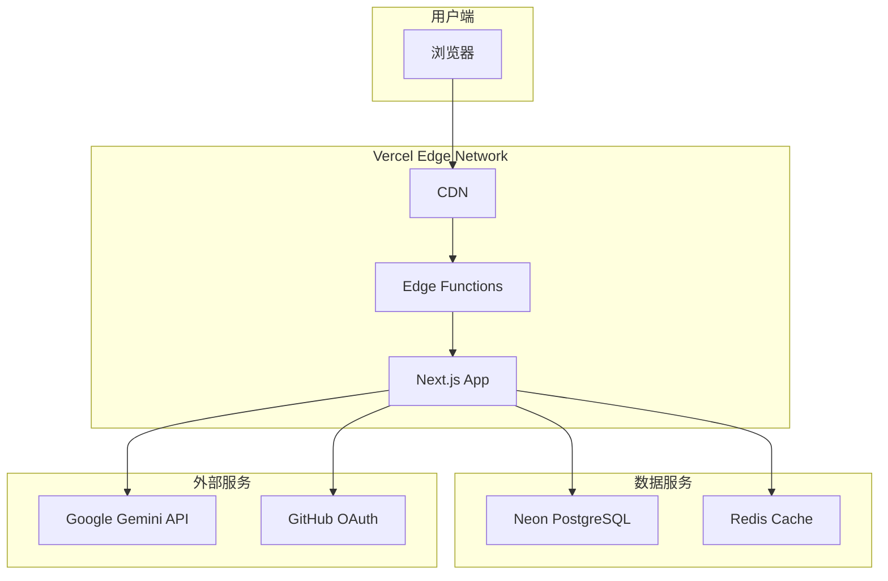

# QuizGen 部署指南

## 目录

1. [概述](#概述)
2. [环境准备](#环境准备)
3. [Vercel 部署](#vercel-部署)
4. [数据库配置](#数据库配置)
5. [环境变量](#环境变量)
6. [自定义域名](#自定义域名)
7. [监控与日志](#监控与日志)
8. [性能优化](#性能优化)
9. [故障排查](#故障排查)
10. [备份与恢复](#备份与恢复)

## 概述

QuizGen 采用现代化的 Serverless 架构，主要部署在以下平台：

- **应用部署**: Vercel（Next.js 应用）
- **数据库**: Neon Serverless PostgreSQL
- **认证服务**: Better Auth（内置）
- **AI 服务**: Google Gemini API

### 部署架构图



## 环境准备

### 前置要求

1. **GitHub 账号** - 用于代码托管和 OAuth 登录
2. **Vercel 账号** - 用于应用部署
3. **Neon 账号** - 用于数据库服务
4. **Google Cloud 账号** - 用于 Gemini API

### 获取必要的凭证

#### 1. Google Gemini API Key

1. 访问 [Google AI Studio](https://aistudio.google.com/app/apikey)
2. 点击 "Create API Key"
3. 选择或创建一个项目
4. 复制生成的 API Key

#### 2. GitHub OAuth App

1. 访问 [GitHub Settings > Developer settings](https://github.com/settings/developers)
2. 点击 "New OAuth App"
3. 填写应用信息：
   - **Application name**: QuizGen
   - **Homepage URL**: `https://your-domain.vercel.app`
   - **Authorization callback URL**: `https://your-domain.vercel.app/api/auth/callback/github`
4. 创建后保存 Client ID 和 Client Secret

#### 3. Neon 数据库

1. 访问 [Neon Console](https://console.neon.tech)
2. 创建新项目
3. 选择区域（建议选择靠近目标用户的区域）
4. 复制连接字符串

## Vercel 部署

### 方法一：通过 Vercel 控制台（推荐）

1. **导入项目**
   - 访问 [Vercel Dashboard](https://vercel.com/dashboard)
   - 点击 "Import Project"
   - 选择你的 GitHub 仓库
   - 选择 "Import"

2. **配置项目**
   ```
   Framework Preset: Next.js
   Root Directory: ./
   Build Command: (默认)
   Output Directory: (默认)
   Install Command: bun install
   ```

3. **设置环境变量**
   在 "Environment Variables" 部分添加所有必需的环境变量（见下方环境变量章节）

4. **部署**
   点击 "Deploy" 开始部署

## 数据库配置

### Neon PostgreSQL 设置

1. **创建数据库**
   ```sql
   -- Neon 会自动创建默认数据库
   -- 确保使用 UTF-8 编码
   ```

2. **配置连接池**
   - 在 Neon 控制台启用 "Pooling"
   - 使用 pooled connection string
   - 设置合适的连接限制

3. **运行迁移**
   ```bash
   # 本地运行迁移到生产数据库
   DATABASE_URL="your-neon-connection-string" bun db:push
   ```

## 环境变量

### 必需的环境变量

| 变量名                 | 描述                       | 示例                                             |
| ---------------------- | -------------------------- | ------------------------------------------------ |
| `DATABASE_URL`         | Neon 数据库连接字符串      | `postgresql://...@neon.tech/...?sslmode=require` |
| `GOOGLE_API_KEY`       | Google Gemini API Key      | `AIza...`                                        |
| `BETTER_AUTH_SECRET`   | Better Auth 加密密钥       | 32位随机字符串                                   |
| `BETTER_AUTH_URL`      | 应用 URL                   | `https://your-app.vercel.app`                    |
| `GITHUB_CLIENT_ID`     | GitHub OAuth Client ID     | `Iv1...`                                         |
| `GITHUB_CLIENT_SECRET` | GitHub OAuth Client Secret | `abc123...`                                      |

### 可选的环境变量

| 变量名                | 描述            | 默认值                 |
| --------------------- | --------------- | ---------------------- |
| `NEXT_PUBLIC_APP_URL` | 公开的应用 URL  | 自动检测               |
| `GEMINI_MODEL`        | Gemini 模型版本 | `gemini-2.0-flash-exp` |
| `LOG_LEVEL`           | 日志级别        | `info`                 |
| `ENABLE_ANALYTICS`    | 启用分析        | `true`                 |

### 在 Vercel 中设置环境变量

1. **通过控制台**
   - 项目设置 > Environment Variables
   - 添加每个变量
   - 选择适用的环境（Production/Preview/Development）

2. **通过 CLI**
   ```bash
   # 添加生产环境变量
   vercel env add DATABASE_URL production
   
   # 从 .env 文件导入
   vercel env pull .env.production
   ```

## 自定义域名

### 配置自定义域名

1. **在 Vercel 中添加域名**
   - 项目设置 > Domains
   - 添加你的域名
   - 按照提示配置 DNS

2. **DNS 配置示例**
   ```
   # A 记录（推荐）
   @ A 76.76.21.21
   
   # 或 CNAME 记录
   www CNAME cname.vercel-dns.com
   ```

3. **SSL 证书**
   - Vercel 自动提供 Let's Encrypt SSL 证书
   - 支持通配符证书

### 域名最佳实践

- 使用 `www` 和根域名
- 设置正确的重定向
- 启用 HSTS

## 监控与日志

### Vercel Analytics

1. **启用 Analytics**
   ```bash
   bun add @vercel/analytics
   ```

2. **集成到应用**
   ```typescript
   // app/layout.tsx
   import { Analytics } from '@vercel/analytics/react';
   
   export default function RootLayout({ children }) {
     return (
       <html>
         <body>
           {children}
           <Analytics />
         </body>
       </html>
     );
   }
   ```

### 日志收集

1. **查看函数日志**
   ```bash
   vercel logs --follow
   ```

2. **结构化日志**
   ```typescript
   // lib/logger.ts
   export const logger = {
     info: (message: string, meta?: any) => {
       console.log(JSON.stringify({ level: 'info', message, ...meta }));
     },
     error: (message: string, error?: any) => {
       console.error(JSON.stringify({ level: 'error', message, error }));
     }
   };
   ```

## 故障排查

### 常见问题

#### 1. 构建失败

**问题**: `Module not found` 错误

**解决方案**:
```bash
# 清理缓存
rm -rf .next node_modules
bun install
bun build
```

#### 2. 数据库连接错误

**问题**: `Connection timeout`

**解决方案**:
- 检查 DATABASE_URL 格式
- 确保使用 pooled connection
- 检查 IP 白名单

#### 3. API 限流

**问题**: `429 Too Many Requests`

**解决方案**:
```typescript
// 实现请求限流
import { Ratelimit } from "@upstash/ratelimit";

const ratelimit = new Ratelimit({
  redis: Redis.fromEnv(),
  limiter: Ratelimit.slidingWindow(10, "10 s"),
});
```

### 调试技巧

1. **启用详细日志**
   ```bash
   DEBUG=* vercel dev
   ```

2. **本地测试生产构建**
   ```bash
   bun build
   bun start
   ```

3. **检查环境变量**
   ```typescript
   console.log('环境变量检查:', {
     hasDatabase: !!process.env.DATABASE_URL,
     hasGeminiKey: !!process.env.GOOGLE_API_KEY,
   });
   ```

## 总结

QuizGen 的部署流程设计为简单且可扩展。通过 Vercel 的自动化部署和 Neon 的 Serverless 数据库，可以快速将应用部署到生产环境。遵循本指南的最佳实践，可以确保应用的稳定性、性能和安全性。