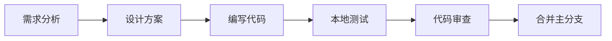

# QuizGen 开发指南

## 目录

1. [开发环境搭建](#开发环境搭建)
2. [项目结构详解](#项目结构详解)
3. [开发工作流](#开发工作流)
4. [代码规范](#代码规范)
5. [组件开发](#组件开发)
6. [Server Actions 开发](#server-actions-开发)
7. [数据库开发](#数据库开发)
8. [测试策略](#测试策略)
9. [调试技巧](#调试技巧)
10. [常见问题](#常见问题)

## 开发环境搭建

### 系统要求

- **操作系统**: macOS, Linux, Windows (WSL2)
- **Node.js**: 18.17+ (通过 Bun 自动管理)
- **Bun**: 1.2.0+
- **Git**: 2.0+
- **Docker**: 20.0+ (可选，用于本地数据库)

### 推荐的开发工具

#### IDE/编辑器

1. **Visual Studio Code** (推荐)
   ```bash
   # 安装推荐扩展
   code --install-extension bradlc.vscode-tailwindcss
   code --install-extension biomejs.biome
   code --install-extension prisma.prisma
   ```

2. **Cursor** (AI 辅助开发)
   - 内置 AI 代码补全
   - 支持所有 VSCode 扩展

#### 浏览器扩展

- React Developer Tools
- Redux DevTools (用于状态调试)

### 环境搭建步骤

#### 1. 克隆项目

```bash
# 使用 SSH (推荐)
git clone git@github.com:GeminiProjects/quizgen.git

# 或使用 HTTPS
git clone https://github.com/GeminiProjects/quizgen.git

cd quizgen
```

#### 2. 安装 Bun

```bash
# macOS/Linux
curl -fsSL https://bun.sh/install | bash

# Windows (PowerShell)
powershell -c "irm bun.sh/install.ps1 | iex"

# 验证安装
bun --version
```

#### 3. 安装依赖

```bash
# 在项目根目录执行
bun install

# 如果遇到缓存问题
bun install --no-cache
```

#### 4. 环境配置

```bash
# 运行配置向导
bun setup

# 或手动复制环境变量
cp .env.example .env.local
```

必需的环境变量：
```env
# 数据库连接
DATABASE_URL="postgresql://..."

# Google Gemini API
GOOGLE_GENERATIVE_AI_API_KEY="AIza..."

# Better Auth
BETTER_AUTH_SECRET="random-32-char-string"

# GitHub OAuth (可选)
GITHUB_CLIENT_ID="..."
GITHUB_CLIENT_SECRET="..."
```

#### 5. 数据库设置

选项 A：使用本地数据库（推荐）
```bash
# 启动本地 PostgreSQL
bun db:start

# 推送数据库架构
bun db:push

# 打开数据库管理界面
bun db:studio
```

选项 B：使用云数据库
1. 在 [Neon](https://neon.tech) 创建数据库
2. 复制连接字符串到 `.env.local`
3. 运行 `bun db:push`

#### 6. 启动开发服务器

```bash
# 启动所有服务
bun dev

# 应用将在以下端口运行：
# - http://localhost:3000 - Next.js 应用
# - https://local.drizzle.studio - 数据库管理界面
```

## 项目结构详解

### Monorepo 架构

```
quizgen/
├── apps/
│   └── web/                    # Next.js 主应用
│       ├── src/
│       │   ├── app/           # App Router
│       │   │   ├── (dashboard)/  # 主功能模块
│       │   │   │   ├── lectures/    # 演讲管理
│       │   │   │   ├── organizations/ # 组织管理
│       │   │   │   └── participation/ # 参与互动
│       │   │   ├── actions/     # Server Actions
│       │   │   ├── api/         # API 路由
│       │   │   └── globals.css  # 全局样式
│       │   ├── components/    # React 组件
│       │   ├── hooks/         # 自定义 Hooks
│       │   ├── lib/           # 工具函数
│       │   └── types.ts       # 类型定义
│       └── public/            # 静态资源
├── packages/
│   ├── ai/                    # AI 功能封装
│   │   ├── src/
│   │   └── package.json
│   ├── auth/                  # 认证模块
│   │   ├── src/
│   │   └── package.json
│   ├── db/                    # 数据库层
│   │   ├── src/
│   │   │   ├── schema/       # 表定义
│   │   │   └── index.ts      # 导出入口
│   │   └── drizzle.config.ts
│   └── ui/                    # UI 组件库
│       ├── src/components/    # shadcn/ui 组件
│       └── package.json
├── docs/                      # 项目文档
├── scripts/                   # 工具脚本
└── turbo.json                # Turborepo 配置
```

### 关键文件说明

#### 配置文件

- `turbo.json` - Turborepo 构建配置
- `biome.json` - 代码检查和格式化规则
- `tsconfig.json` - TypeScript 配置
- `.env.example` - 环境变量示例

#### 应用入口

- `apps/web/src/app/layout.tsx` - 根布局
- `apps/web/src/app/page.tsx` - 首页
- `apps/web/src/middleware.ts` - 中间件

## 开发工作流

### 1. 创建新功能分支

```bash
# 同步主分支
git checkout main
git pull upstream main

# 创建功能分支
git checkout -b feature/your-feature-name
```

### 2. 开发流程



### 3. 常用开发命令

```bash
# 开发
bun dev              # 启动开发服务器
bun dev --turbo      # 使用 Turbopack (更快)

# 构建
bun build            # 构建所有包
bun build --filter=web  # 只构建 web 应用

# 测试
bun test             # 运行所有测试
bun test:watch       # 监听模式

# 代码质量
bun check            # 类型检查 + 代码检查
bun format           # 格式化代码
bun format:check     # 检查格式

# 数据库
bun db:push          # 推送架构变更
bun db:studio        # 数据库管理界面
bun db:generate      # 生成迁移文件
```

## 代码规范

### TypeScript 规范

#### 1. 类型定义

```typescript
// ✅ 推荐：使用 interface 定义对象类型
interface User {
  id: string;
  name: string;
  email: string;
}

// ✅ 推荐：使用 type 定义联合类型
type Status = 'idle' | 'loading' | 'success' | 'error';

// ❌ 避免：使用 any
const data: any = fetchData();

// ✅ 推荐：使用 unknown
const data: unknown = fetchData();
```

#### 2. 导入规范

```typescript
// ✅ 推荐：类型导入使用 import type
import type { User } from '@/types';
import { useState } from 'react';

// ✅ 推荐：按类别分组
// 1. React/Next.js
import { useState, useEffect } from 'react';
import { useRouter } from 'next/navigation';

// 2. 外部包
import { format } from 'date-fns';

// 3. 内部包
import { Button } from '@repo/ui/components/button';

// 4. 本地导入
import { useAuth } from '@/hooks/use-auth';
import type { Lecture } from '@/types';
```

### React 组件规范

#### 1. 函数组件

```typescript
// ✅ 推荐：使用函数声明
export function UserProfile({ user }: UserProfileProps) {
  return <div>{user.name}</div>;
}

// ❌ 避免：箭头函数（除非需要）
export const UserProfile = ({ user }: UserProfileProps) => {
  return <div>{user.name}</div>;
};
```

#### 2. Props 接口

```typescript
// ✅ 推荐：Props 接口命名
interface ComponentNameProps {
  title: string;
  onClose?: () => void;
  children: React.ReactNode;
}

// ✅ 推荐：使用解构和默认值
export function Modal({ 
  title, 
  onClose, 
  children 
}: ModalProps) {
  // 实现
}
```

#### 3. Hooks 使用

```typescript
// ✅ 推荐：自定义 Hook 以 use 开头
export function useDebounce<T>(value: T, delay: number): T {
  const [debouncedValue, setDebouncedValue] = useState(value);
  
  useEffect(() => {
    const handler = setTimeout(() => {
      setDebouncedValue(value);
    }, delay);
    
    return () => clearTimeout(handler);
  }, [value, delay]);
  
  return debouncedValue;
}
```

### 样式规范

#### 1. TailwindCSS 类名

```typescript
// ✅ 推荐：使用 cn 工具合并类名
import { cn } from '@/lib/utils';

<div className={cn(
  'flex items-center gap-4',
  'rounded-lg border p-4',
  isActive && 'bg-primary text-white',
  className
)}>

// ✅ 推荐：响应式设计
<div className="grid grid-cols-1 md:grid-cols-2 lg:grid-cols-3 gap-4">
```

#### 2. 颜色系统

```typescript
// ✅ 推荐：使用语义化颜色
<div className="bg-primary text-primary-foreground">
<div className="bg-destructive/10 text-destructive">

// ❌ 避免：硬编码颜色
<div className="bg-blue-500 text-white">
```

## 组件开发

### 1. 创建新组件

```bash
# 应用级组件
touch apps/web/src/components/lecture-card.tsx

# 共享 UI 组件
touch packages/ui/src/components/badge.tsx
```

### 2. 组件模板

```typescript
'use client';

import { useState } from 'react';
import { cn } from '@/lib/utils';

interface LectureCardProps {
  lecture: Lecture;
  onEdit?: (id: string) => void;
  className?: string;
}

export function LectureCard({ 
  lecture, 
  onEdit,
  className 
}: LectureCardProps) {
  const [isExpanded, setIsExpanded] = useState(false);
  
  return (
    <div className={cn(
      'rounded-lg border p-4',
      'transition-all hover:shadow-md',
      className
    )}>
      <h3 className="text-lg font-semibold">
        {lecture.title}
      </h3>
      
      {lecture.description && (
        <p className="mt-2 text-muted-foreground">
          {lecture.description}
        </p>
      )}
      
      <div className="mt-4 flex items-center justify-between">
        <Badge variant="secondary">
          {lecture.status}
        </Badge>
        
        {onEdit && (
          <Button
            size="sm"
            variant="ghost"
            onClick={() => onEdit(lecture.id)}
          >
            编辑
          </Button>
        )}
      </div>
    </div>
  );
}
```

### 3. 组件测试

```typescript
// lecture-card.test.tsx
import { render, screen } from '@testing-library/react';
import { LectureCard } from './lecture-card';

describe('LectureCard', () => {
  const mockLecture = {
    id: '1',
    title: '测试演讲',
    description: '这是一个测试',
    status: 'not_started',
  };
  
  it('renders lecture title', () => {
    render(<LectureCard lecture={mockLecture} />);
    expect(screen.getByText('测试演讲')).toBeInTheDocument();
  });
  
  it('calls onEdit when edit button clicked', () => {
    const handleEdit = jest.fn();
    render(
      <LectureCard 
        lecture={mockLecture} 
        onEdit={handleEdit} 
      />
    );
    
    fireEvent.click(screen.getByText('编辑'));
    expect(handleEdit).toHaveBeenCalledWith('1');
  });
});
```

## Server Actions 开发

### 1. 创建 Server Action

```typescript
// apps/web/src/app/actions/lectures.ts
'use server';

import { revalidatePath } from 'next/cache';
import { db } from '@repo/db';
import { requireAuth } from '@/lib/auth';
import type { ActionResult } from '@/types';

export async function createLecture(
  input: CreateLectureInput
): Promise<ActionResult<Lecture>> {
  try {
    // 1. 身份验证
    const session = await requireAuth();
    
    // 2. 参数验证
    const validated = createLectureSchema.parse(input);
    
    // 3. 业务逻辑
    const lecture = await db.transaction(async (tx) => {
      // 创建演讲
      const [lecture] = await tx
        .insert(lectures)
        .values({
          ...validated,
          owner_id: session.user.id,
          join_code: generateJoinCode(),
        })
        .returning();
        
      // 添加创建者为参与者
      await tx.insert(lectureParticipants).values({
        lecture_id: lecture.id,
        user_id: session.user.id,
        role: 'speaker',
      });
      
      return lecture;
    });
    
    // 4. 重新验证缓存
    revalidatePath('/lectures');
    revalidatePath(`/lectures/${lecture.id}`);
    
    // 5. 返回结果
    return { success: true, data: lecture };
  } catch (error) {
    console.error('创建演讲失败:', error);
    return handleActionError(error);
  }
}
```

### 2. 使用 Server Action

```typescript
// components/create-lecture-form.tsx
'use client';

import { useRouter } from 'next/navigation';
import { createLecture } from '@/app/actions/lectures';
import { toast } from 'sonner';

export function CreateLectureForm() {
  const router = useRouter();
  const [isPending, startTransition] = useTransition();
  
  async function handleSubmit(formData: FormData) {
    startTransition(async () => {
      const result = await createLecture({
        title: formData.get('title') as string,
        description: formData.get('description') as string,
      });
      
      if (result.success) {
        toast.success('演讲创建成功');
        router.push(`/lectures/${result.data.id}`);
      } else {
        toast.error(result.error);
      }
    });
  }
  
  return (
    <form action={handleSubmit}>
      <input name="title" required />
      <textarea name="description" />
      <button type="submit" disabled={isPending}>
        {isPending ? '创建中...' : '创建演讲'}
      </button>
    </form>
  );
}
```

## 数据库开发

### 1. 添加新表

```typescript
// packages/db/src/schema/notifications.ts
import { pgTable, uuid, text, timestamp, boolean } from 'drizzle-orm/pg-core';
import { timestamps } from './columns.helpers';

export const notifications = pgTable('notifications', {
  id: uuid('id').primaryKey().defaultRandom(),
  user_id: text('user_id').notNull().references(() => users.id),
  title: text('title').notNull(),
  content: text('content'),
  read: boolean('read').notNull().default(false),
  ...timestamps,
});

// 导出类型
export type Notification = typeof notifications.$inferSelect;
export type NewNotification = typeof notifications.$inferInsert;
```

### 2. 生成迁移

```bash
# 生成迁移文件
bun db:generate

# 查看生成的 SQL
cat packages/db/migrations/0001_add_notifications.sql

# 应用迁移
bun db:push
```

### 3. 查询示例

```typescript
// 基础查询
const userLectures = await db
  .select()
  .from(lectures)
  .where(eq(lectures.owner_id, userId));

// 联表查询
const lectureWithStats = await db
  .select({
    lecture: lectures,
    participantCount: count(lectureParticipants.id),
    quizCount: count(quizItems.id),
  })
  .from(lectures)
  .leftJoin(
    lectureParticipants,
    eq(lectures.id, lectureParticipants.lecture_id)
  )
  .leftJoin(
    quizItems,
    eq(lectures.id, quizItems.lecture_id)
  )
  .where(eq(lectures.id, lectureId))
  .groupBy(lectures.id);

// 事务操作
await db.transaction(async (tx) => {
  await tx.update(lectures)
    .set({ status: 'ended' })
    .where(eq(lectures.id, lectureId));
    
  await tx.update(lectureParticipants)
    .set({ status: 'left', left_at: new Date() })
    .where(
      and(
        eq(lectureParticipants.lecture_id, lectureId),
        eq(lectureParticipants.status, 'active')
      )
    );
});
```

## 测试策略

### 1. 单元测试

```typescript
// lib/utils.test.ts
import { generateJoinCode } from './utils';

describe('generateJoinCode', () => {
  it('generates 6 character code', () => {
    const code = generateJoinCode();
    expect(code).toHaveLength(6);
  });
  
  it('only contains uppercase letters and numbers', () => {
    const code = generateJoinCode();
    expect(code).toMatch(/^[A-Z0-9]{6}$/);
  });
});
```

### 2. 集成测试

```typescript
// __tests__/lectures.test.ts
import { createLecture, getLectures } from '@/app/actions/lectures';

describe('Lectures API', () => {
  it('creates and retrieves lecture', async () => {
    // 创建演讲
    const createResult = await createLecture({
      title: '测试演讲',
      description: '测试描述',
    });
    
    expect(createResult.success).toBe(true);
    
    // 获取演讲列表
    const listResult = await getLectures();
    expect(listResult.data.data).toContainEqual(
      expect.objectContaining({
        id: createResult.data.id,
        title: '测试演讲',
      })
    );
  });
});
```

### 3. E2E 测试

```typescript
// e2e/create-lecture.spec.ts
import { test, expect } from '@playwright/test';

test('create new lecture', async ({ page }) => {
  // 登录
  await page.goto('/login');
  await page.click('button:has-text("使用 GitHub 登录")');
  
  // 创建演讲
  await page.goto('/lectures/new');
  await page.fill('input[name="title"]', 'E2E 测试演讲');
  await page.fill('textarea[name="description"]', '这是一个 E2E 测试');
  await page.click('button[type="submit"]');
  
  // 验证跳转
  await expect(page).toHaveURL(/\/lectures\/.+/);
  await expect(page.locator('h1')).toContainText('E2E 测试演讲');
});
```

## 调试技巧

### 1. 开发工具

#### React DevTools

```typescript
// 在组件中添加调试信息
useEffect(() => {
  console.log('Component mounted', { props });
  return () => console.log('Component unmounted');
}, []);
```

#### 浏览器调试

```typescript
// 添加断点
debugger;

// 条件断点
if (condition) {
  debugger;
}
```

### 2. Server Actions 调试

```typescript
// 添加日志
export async function myAction(input: Input) {
  console.log('Action called with:', input);
  
  try {
    const result = await someOperation();
    console.log('Operation result:', result);
    return { success: true, data: result };
  } catch (error) {
    console.error('Action failed:', error);
    return { success: false, error: error.message };
  }
}
```

### 3. 数据库查询调试

```typescript
// 启用查询日志
const db = drizzle(client, {
  logger: true,
});

// 或使用自定义日志
const db = drizzle(client, {
  logger: {
    logQuery(query, params) {
      console.log('Query:', query);
      console.log('Params:', params);
    },
  },
});
```

### 4. 性能分析

```typescript
// 测量组件渲染时间
const ProfiledComponent = () => {
  const start = performance.now();
  
  useEffect(() => {
    const end = performance.now();
    console.log(`Render took ${end - start}ms`);
  });
  
  return <div>...</div>;
};

// 使用 React Profiler
import { Profiler } from 'react';

<Profiler
  id="Navigation"
  onRender={(id, phase, actualDuration) => {
    console.log({ id, phase, actualDuration });
  }}
>
  <Navigation />
</Profiler>
```

## 常见问题

### Q: 如何处理 "Module not found" 错误？

```bash
# 清理并重新安装
rm -rf node_modules .next
bun install --no-cache
bun dev
```

### Q: 如何解决类型错误？

```bash
# 重新生成类型
bun --filter=@repo/db generate

# 检查类型
bun check
```

### Q: Server Actions 返回 "Unauthorized" 错误？

确保：
1. 用户已登录
2. Server Action 调用了 `requireAuth()`
3. 环境变量配置正确

### Q: 数据库连接失败？

检查：
1. DATABASE_URL 格式是否正确
2. 数据库服务是否运行
3. 网络连接是否正常

```bash
# 测试数据库连接
bun db:studio
```

### Q: 构建失败？

```bash
# 查看详细错误
bun build --debug

# 尝试清理缓存
rm -rf .next .turbo
bun build
```

### Q: 如何提高开发效率？

1. **使用代码片段**
   ```json
   // .vscode/snippets.json
   {
     "Server Action": {
       "prefix": "sa",
       "body": [
         "'use server';",
         "",
         "export async function ${1:actionName}(input: ${2:Input}): Promise<ActionResult<${3:Output}>> {",
         "  try {",
         "    const session = await requireAuth();",
         "    $0",
         "    return { success: true, data: result };",
         "  } catch (error) {",
         "    return handleActionError(error);",
         "  }",
         "}"
       ]
     }
   }
   ```

2. **使用 AI 助手**
   - GitHub Copilot
   - Cursor AI
   - Codeium

3. **键盘快捷键**
   - `Cmd+P`: 快速打开文件
   - `Cmd+Shift+P`: 命令面板
   - `Cmd+B`: 切换侧边栏

## 总结

QuizGen 的开发环境配置简单，开发体验优秀。通过遵循本指南的最佳实践，可以高效地进行功能开发和问题调试。记住始终保持代码质量，编写清晰的注释，并充分测试你的代码。

有问题？查看[贡献指南](../CONTRIBUTING.md)或在 [GitHub Discussions](https://github.com/GeminiProjects/quizgen/discussions) 寻求帮助。