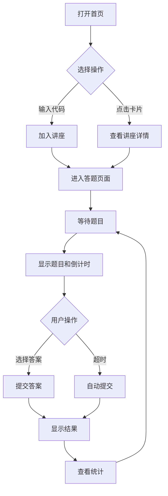
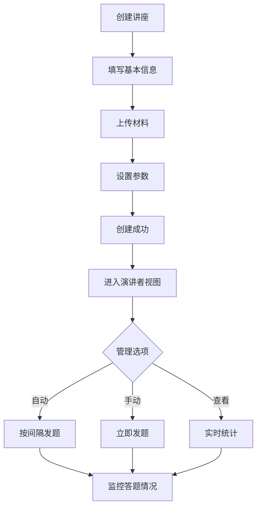

# QuizGen 前端线框图与交互设计

## 1. 首页 Dashboard (/)

### 布局结构
```
┌─────────────────────────────────────────────────────┐
│  Logo  QuizGen          搜索框            用户头像 ▼ │ <- 顶部导航栏
├─────────────────────────────────────────────────────┤
│                                                     │
│  欢迎回来，[用户名] 👋                               │
│                                                     │
│  ┌─────────────────────────────────────────────┐  │
│  │  快速操作                                     │  │
│  │  ┌─────────┐  ┌─────────┐  ┌─────────┐    │  │
│  │  │  创建   │  │  加入   │  │  查看   │    │  │
│  │  │  讲座   │  │  讲座   │  │  统计   │    │  │
│  │  └─────────┘  └─────────┘  └─────────┘    │  │
│  └─────────────────────────────────────────────┘  │
│                                                     │
│  我的讲座                                 查看全部 > │
│  ┌─────────────────────────────────────────────┐  │
│  │ ┌───────────┐ ┌───────────┐ ┌───────────┐  │  │
│  │ │           │ │           │ │           │  │  │
│  │ │  机器学习  │ │  数据结构  │ │  算法设计  │  │  │
│  │ │  基础     │ │  与算法   │ │  与分析   │  │  │
│  │ │           │ │           │ │           │  │  │
│  │ │ 12月15日  │ │ 12月14日  │ │ 12月13日  │  │  │
│  │ │ 45人参与  │ │ 38人参与  │ │ 52人参与  │  │  │
│  │ └───────────┘ └───────────┘ └───────────┘  │  │
│  └─────────────────────────────────────────────┘  │
│                                                     │
│  最近参与                                 查看全部 > │
│  ┌─────────────────────────────────────────────┐  │
│  │ • Python编程入门 - 张教授 - 85分 ✓           │  │
│  │ • 网络安全基础 - 李教授 - 92分 ✓             │  │
│  │ • 人工智能导论 - 王教授 - 78分 ✓             │  │
│  └─────────────────────────────────────────────┘  │
└─────────────────────────────────────────────────────┘
```

### 交互说明
- **创建讲座**：点击后跳转到讲座创建页面
- **加入讲座**：弹出输入框，输入讲座代码加入
- **查看统计**：跳转到个人统计页面
- **讲座卡片**：点击进入对应的讲座详情页

## 2. 讲座创建页 (/lecture/create)

### 布局结构
```
┌─────────────────────────────────────────────────────┐
│  ← 返回  创建新讲座                                  │
├─────────────────────────────────────────────────────┤
│                                                     │
│  基本信息                                           │
│  ┌─────────────────────────────────────────────┐  │
│  │ 讲座标题 *                                   │  │
│  │ ┌─────────────────────────────────────┐    │  │
│  │ │                                       │    │  │
│  │ └─────────────────────────────────────┘    │  │
│  │                                             │  │
│  │ 讲座描述                                    │  │
│  │ ┌─────────────────────────────────────┐    │  │
│  │ │                                       │    │  │
│  │ │                                       │    │  │
│  │ └─────────────────────────────────────┘    │  │
│  │                                             │  │
│  │ 预计时长        出题间隔                    │  │
│  │ ┌──────────┐   ┌──────────┐               │  │
│  │ │ 60 分钟 ▼│   │ 10 分钟 ▼│               │  │
│  │ └──────────┘   └──────────┘               │  │
│  └─────────────────────────────────────────────┘  │
│                                                     │
│  上传材料                                           │
│  ┌─────────────────────────────────────────────┐  │
│  │  ┌ ─ ─ ─ ─ ─ ─ ─ ─ ─ ─ ─ ─ ─ ─ ─ ─ ─ ┐    │  │
│  │   │                                     │    │  │
│  │   │        拖拽文件到此处或点击上传        │    │  │
│  │   │     支持 PPT, PDF, MP3, MP4 格式     │    │  │
│  │   │                                     │    │  │
│  │  └ ─ ─ ─ ─ ─ ─ ─ ─ ─ ─ ─ ─ ─ ─ ─ ─ ─ ┘    │  │
│  │                                             │  │
│  │  已上传文件：                               │  │
│  │  • lecture_slides.pptx (15.2 MB) ×         │  │
│  │  • supplementary.pdf (3.8 MB) ×            │  │
│  └─────────────────────────────────────────────┘  │
│                                                     │
│  高级设置                                           │
│  ┌─────────────────────────────────────────────┐  │
│  │ □ 允许实时录音转文字                        │  │
│  │ □ 题目因人而异                              │  │
│  │ □ 显示实时统计                              │  │
│  └─────────────────────────────────────────────┘  │
│                                                     │
│          [ 取消 ]            [ 创建讲座 ]          │
└─────────────────────────────────────────────────────┘
```

## 3. 听众答题页 (/lecture/[id])

### 布局结构
```
┌─────────────────────────────────────────────────────┐
│  机器学习基础 - 第 3 题                   退出讲座 × │
├─────────────────────────────────────────────────────┤
│                                                     │
│  ┌─────────────────────────────────────────────┐  │
│  │ ████████████████░░░░░░░░░░░░  剩余 6 秒     │  │ <- 倒计时条
│  └─────────────────────────────────────────────┘  │
│                                                     │
│  ┌─────────────────────────────────────────────┐  │
│  │                                             │  │
│  │  下列哪个不是监督学习算法？                   │  │
│  │                                             │  │
│  └─────────────────────────────────────────────┘  │
│                                                     │
│  ┌─────────────────────────────────────────────┐  │
│  │  A  决策树                                  │  │
│  └─────────────────────────────────────────────┘  │
│                                                     │
│  ┌─────────────────────────────────────────────┐  │
│  │  B  K-Means 聚类                           │  │
│  └─────────────────────────────────────────────┘  │
│                                                     │
│  ┌─────────────────────────────────────────────┐  │
│  │  C  支持向量机                              │  │
│  └─────────────────────────────────────────────┘  │
│                                                     │
│  ┌─────────────────────────────────────────────┐  │
│  │  D  随机森林                                │  │
│  └─────────────────────────────────────────────┘  │
│                                                     │
│                  [ 提交答案 ]                       │
│                                                     │
│  ─────────────────────────────────────────────     │
│  当前得分：85 分  |  已答题：8/10                   │
└─────────────────────────────────────────────────────┘
```

### 答题结果展示
```
┌─────────────────────────────────────────────────────┐
│  机器学习基础 - 第 3 题                   退出讲座 × │
├─────────────────────────────────────────────────────┤
│                                                     │
│  ┌─────────────────────────────────────────────┐  │
│  │                 答题结果                    │  │
│  └─────────────────────────────────────────────┘  │
│                                                     │
│  ┌─────────────────────────────────────────────┐  │
│  │  ✗ 回答错误                                 │  │
│  │                                             │  │
│  │  您的答案：A                                │  │
│  │  正确答案：B                                │  │
│  │                                             │  │
│  │  解析：K-Means 是一种无监督学习算法，        │  │
│  │  用于聚类分析，不需要标记的训练数据。         │  │
│  └─────────────────────────────────────────────┘  │
│                                                     │
│  本题统计                                          │
│  ┌─────────────────────────────────────────────┐  │
│  │  A: 25%  ████████                          │  │
│  │  B: 60%  ████████████████████              │  │
│  │  C: 10%  ███                               │  │
│  │  D: 5%   ██                                │  │
│  └─────────────────────────────────────────────┘  │
│                                                     │
│            等待下一题... (约 8 分钟后)              │
└─────────────────────────────────────────────────────┘
```

## 4. 演讲者视图 (/lecture/[id]/speaker)

### 布局结构
```
┌─────────────────────────────────────────────────────┐
│  机器学习基础 - 演讲者视图        [开始录音] 设置 ⚙ │
├─────────────────────────────────────────────────────┤
│                                                     │
│  当前状态：进行中  |  已发题：3/10  |  在线人数：45  │
│                                                     │
│  ┌───────────────────────┬─────────────────────┐  │
│  │  实时统计              │  题目控制           │  │
│  ├───────────────────────┼─────────────────────┤  │
│  │                       │                     │  │
│  │  当前题目（第3题）     │  下一题预览：       │  │
│  │  答题人数：42/45      │  "什么是过拟合？"    │  │
│  │  平均用时：7.2秒      │                     │  │
│  │                       │  自动发题倒计时：    │  │
│  │  正确率：71%          │  ████░░░░ 4:32     │  │
│  │  ┌─────────────────┐  │                     │  │
│  │  │   71%           │  │  [ 立即发题 ]      │  │
│  │  │  ████           │  │  [ 跳过此题 ]      │  │
│  │  │                │  │                     │  │
│  │  └─────────────────┘  │                     │  │
│  │                       │                     │  │
│  │  选项分布：           │  材料处理状态：      │  │
│  │  A: 12人 (29%)       │  ✓ PPT 已解析       │  │
│  │  B: 30人 (71%)  ✓    │  ✓ 音频转录中...    │  │
│  │  C: 0人  (0%)        │  • 已生成 3 题      │  │
│  │  D: 0人  (0%)        │  • 待生成 7 题      │  │
│  └───────────────────────┴─────────────────────┘  │
│                                                     │
│  历史题目                                           │
│  ┌─────────────────────────────────────────────┐  │
│  │ 题1: 什么是机器学习？ - 正确率 89% ✓        │  │
│  │ 题2: 监督学习的特点？ - 正确率 76% ✓        │  │
│  └─────────────────────────────────────────────┘  │
└─────────────────────────────────────────────────────┘
```

## 5. 统计分析页 (/stats)

### 布局结构
```
┌─────────────────────────────────────────────────────┐
│  ← 返回  个人学习统计                               │
├─────────────────────────────────────────────────────┤
│                                                     │
│  总览                                               │
│  ┌───────────┬───────────┬───────────┬──────────┐ │
│  │ 参与讲座  │ 答题总数  │ 平均得分  │ 最高分   │ │
│  │    24     │   312     │   82.5    │   98     │ │
│  └───────────┴───────────┴───────────┴──────────┘ │
│                                                     │
│  学习趋势                                           │
│  ┌─────────────────────────────────────────────┐  │
│  │  100 ┃     ╱╲    ╱╲                       │  │
│  │   90 ┃    ╱  ╲  ╱  ╲    ╱╲               │  │
│  │   80 ┃   ╱    ╲╱    ╲  ╱  ╲              │  │
│  │   70 ┃  ╱              ╲╱    ╲  ╱╲        │  │
│  │   60 ┃ ╱                      ╲╱  ╲       │  │
│  │      ┗━━━━━━━━━━━━━━━━━━━━━━━━━━━━━━━━    │  │
│  │        11月  12月  1月   2月   3月   4月    │  │
│  └─────────────────────────────────────────────┘  │
│                                                     │
│  学科表现                                           │
│  ┌─────────────────────────────────────────────┐  │
│  │ 计算机科学  ████████████████████  92%      │  │
│  │ 数学       ███████████████  85%            │  │
│  │ 物理       ████████████  78%               │  │
│  │ 英语       ██████████  72%                 │  │
│  └─────────────────────────────────────────────┘  │
│                                                     │
│  最近测验                              导出数据 ↓  │
│  ┌─────────────────────────────────────────────┐  │
│  │ 日期      讲座名称        得分    排名      │  │
│  │ 12/15    机器学习基础     85     12/45     │  │
│  │ 12/14    数据结构与算法   92     5/38      │  │
│  │ 12/13    算法设计与分析   78     18/52     │  │
│  └─────────────────────────────────────────────┘  │
└─────────────────────────────────────────────────────┘
```

## 交互流程图

### 1. 用户参与讲座流程


### 2. 演讲者创建和管理流程


## 响应式设计考虑

### 移动端适配
- **答题页面**：垂直布局，选项使用大按钮
- **统计图表**：简化为列表视图
- **导航**：使用底部导航栏

### 平板适配
- **Dashboard**：2列卡片布局
- **演讲者视图**：左右分栏布局

### 桌面端
- **完整功能展示**
- **多列布局**
- **详细的数据可视化**

## 无障碍设计

1. **键盘导航**
   - Tab 键遍历所有交互元素
   - Enter 键确认选择
   - Esc 键关闭弹窗

2. **屏幕阅读器支持**
   - 所有按钮和链接有明确的 aria-label
   - 动态内容更新时通知屏幕阅读器

3. **视觉辅助**
   - 高对比度模式
   - 足够大的点击区域（最小 44x44px）
   - 清晰的焦点指示器